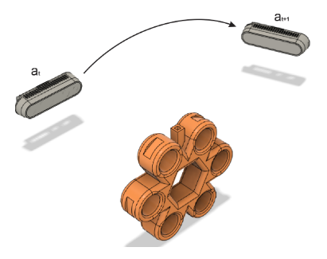

## Next Best View via Topological Features

### Overview

The challenge of obtaining a series of updated robotic sensor placements is
known as the next best view (NBV) problem. Concretely, given a known sensor
pose and an information value, the next placement of the robot's sensor should
ensure that the value obtained maximizes the information gain across the full
action space of the sensor. Information gain is calculated between two
subsequent views, and the full gain of a sequence of views is the sum of the
individual consecutive gains.

<p align="center">

</p>

This repository holds software, data, and CAD files for our 2021 ICRA paper
titled "[Learning the Next Best View for 3D Point Clouds via Topological
Features](https://arxiv.org/abs/2103.02789)." Specifically, we introduce a
reinforcement learning approach utilizing a novel topology-based information
gain metric for directing the NBV of a noisy 3D sensor. The metric combines the
disjoint sections of an observed surface to focus on high-detail features such
as holes and concave sections.

### Citation

If you find this project useful, then please consider citing our work.

```
@inproceedings{collander2021learning,
  title={Learning the Next Best View for 3D Point Clouds via Topological Features},
  author={Collander, Christopher and Beksi, William J and Huber, Manfred},
  booktitle={Proceedings of the IEEE International Conference on Robotics and Automation (ICRA)},
  pages={12207--12213},
  year={2021}
}
```

### Usage 

These instructions will get you a copy of the project up and running on your machine.

#### Prerequisites

* PCL
* Boost-Filesystem
* Intel RealSense SDK

#### Installation

Download the [Dynamixel SDK](https://github.com/ROBOTIS-GIT/DynamixelSDK/tree/master/c%2B%2B/include/dynamixel_sdk), read the included license, and copy all files in the SDK's include folder to the include folder for this software.

From the primary folder run

```
cmake .
```

And compile with

```
make
```

#### Armcontrol Program

Armcontrol is meant to be used with the corresponding 2-DOF manipulator to obtain 3D point clouds from an Intel RealSense D415 in various positions. The filenames are encoded with the motor positions as {yaw}_{pitch}.pcd, ex: 1024_2386.pcd. Files are saved in the current folder. The default configuration is to randomly sample the action space of the motors, however functions in the code are abstracted to allow changes to be easily made if another method is preferred.

Run the program as 

```
./armcontrol
```

#### Transform, Union, Registration (TUR) Program

TUR is used to combine multiple 3D point clouds from the Armcontrol software. It does the following:

* Translates each point cloud to the world coordinate frame based on the coordinates in the filename formatted as {yaw}_{pitch}.pcd, ex: 1024_2386.pcd

* Unions each of the point clouds together into a single file

* Uses iterative closest point (ICP) registration to match the point clouds

Run the program as

```
./transform_and_union out_file.pcd {yaw1}_{pitch1}.pcd [{yaw2}_{pitch2}.pcd] [{yaw3}_{pitch3}.pcd] ...
```

### Authors

* Chris Collander &lt;christopher.collander@mavs.uta.edu&gt;

### License 

[](https://github.com/robotic-vision-lab/Next-Best-View-Via-Topological-Features/blob/master/LICENSE.md)
